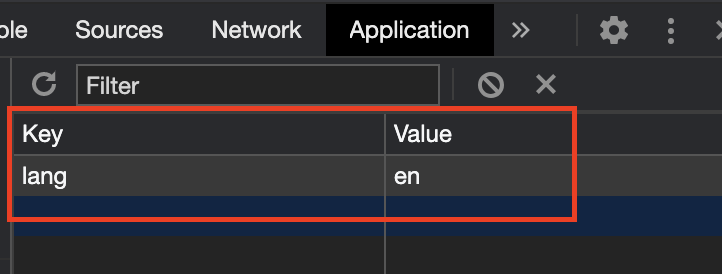

# use-mini18n

[](https://travis-ci.org/shinshin86/use-mini18n)


<div style="text-align: center;">
  A <b>simple</b> and <b>minimalistic</b> React hook library for i18n.<br />
  It is simple but not full of features.<br />
  In that case, I would recommend using another library for i18n.
</div>

## Install

```bash
npm insatll use-mini18n
# or
yarn add use-mini18n
```

## Usage

This is an example using [Next.js](https://github.com/vercel/next.js/).

See also [examples](https://github.com/shinshin86/use-mini18n/tree/master/examples).

```jsx
// pages/_app.jsx
import { TransProvider } from 'use-mini18n';
import i18n from '../i18n';

export default function MyApp({ Component, pageProps }) {
  return (
    <TransProvider i18n={i18n}>
      <Component {...pageProps} />
    </TransProvider>
  );
}
```

This sets the language information required for `i18n.js`.

```js
// i18n.js
const i18n = {
  /*
   * The first language will be set as the default language.
   * However, it is also possible to set the default language by specifying defaultLang.
   */
  en: {
    'Hello Next.js': 'Hello Next.js',
    'Hello someone': 'Hello {name1} and {name2}',
  },
  ja: {
    'Hello Next.js': 'こんにちは Next.js',
    'Hello someone': 'こんにちは {name1} と {name2}',
  },
};

export default i18n;
```

Use `useI18n`.

- `t` refers to text with selected language.
- `lang` returns the currently selected language.
- `langs` returns a list of language information set in `i18n.js`.
- Change to another language using the `changeLang` function.
- Get the text dynamically by passing set parameters and text keys to the `getText` function.

```jsx
// pages/index.jsx
import Layout from '../components/Layout';
import { useI18n } from 'use-mini18n';

const IndexPage = () => {
  const { t, lang, langs, changeLang, getText } = useI18n();

  return (
    <Layout title="Home | Next.js + TypeScript Example">
      <h1>{t['Hello Next.js']} 👋</h1>
      <h2>
        {getText('Hello someone', { name1: 'TestUser1', name2: 'TestUser2' })}
      </h2>
      <p>Selected Language: {lang}</p>
      <select
        name="lang"
        onChange={({ target }) => changeLang(target.value)}
        value={lang}
      >
        {langs.map((l, i) => (
          <option value={l} key={i}>
            {l}
          </option>
        ))}
      </select>
    </Layout>
  );
};

export default IndexPage;
```

## Store selected language

`use-mini18n` stores the selected language information in `localStorage`.



It is also possible to disable the use of localStorage by passing an option during initialization.

```jsx
<TransProvider i18n={i18n} enableLocalStorage={false}>
  <App />
</TransProvider>
```
